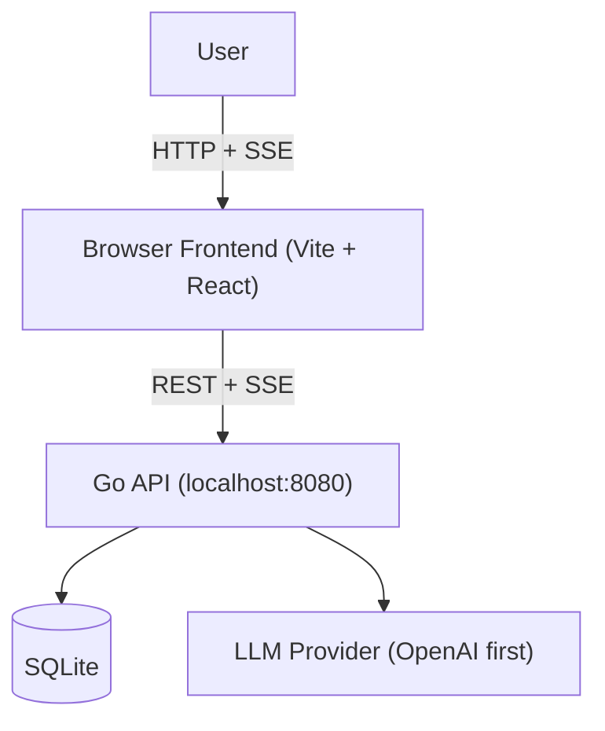

# OpenADE Architecture

## Purpose & Positioning

OpenADE is a "chat-to-task" tool for repeatable LLM workflows. Users chat with an LLM to explore a use case, then save the conversation as a reusable task with templated inputs. The core product insight: repeatable tasks matter more than one-off chat.

## Design Principles

- **MVP narrowing** – Ship the smallest slice that delivers value.
- **Local-first** – Data stays on the user's machine. No cloud backend.
- **Shippable slices** – Each milestone produces a runnable artifact.
- **Contract-first integration** – Frontend and backend align on route and event contracts before coding.
- **Small public surface** – Keep persistence and orchestration local, avoid extra infra.

## Tech Stack

- **Backend**: Go – HTTP API, SQLite via `modernc.org/sqlite` or `go-sqlite3`
- **Frontend**: TypeScript – React + Vite
- **Runtime tooling**: pnpm scripts for local orchestration.

## Deployment Model

OpenADE runs as a local web application during development. The Go backend runs as an HTTP server (e.g. `localhost:8080`). The TypeScript frontend runs in the browser and talks to the Go API. SQLite lives alongside the Go binary. For production, the frontend can be wrapped with Tauri (Rust) to create a native Mac desktop app, or deployed as a static build. This is not serverless; it is not web-hosted.

## Runtime Topology



### Environment Contract

- `OPENADE_PORT`: API bind port (default `8080`)
- `OPENADE_DB_PATH`: SQLite storage path
- `VITE_API_URL`: Frontend base URL (default `http://localhost:8080`)

## Core Modules

- **Model adapter** – Abstracts LLM provider APIs (OpenAI, Anthropic, etc.), handles streaming and token counting
- **Chat service** – Manages conversations and messages
- **Task service** – Manages task CRUD, template rendering, versioning
- **Run service** – Executes tasks, tracks costs, stores outputs
- **Memory store** – Key-value storage per task for run context

### Module Responsibilities (v1 boundaries)

- `internal/handlers`: transport + validation + shape conversion (no heavy business logic).
- `internal/services`: domain orchestration and transaction boundaries.
- `internal/db`: schema, migrations, persistence helpers.
- `internal/llm`: provider abstraction and token/cost extraction.
- `frontend/lib`: API client and SSE parsing.
- `frontend/components`: presentational and interaction layer.
- `frontend/lib/store`: UI state and ephemeral preferences.

## Data Model

- **conversations** – Chat sessions
- **messages** – Messages within a conversation
- **tasks** – Saved prompt templates with metadata
- **task_versions** – Revision history for tasks
- **runs** – Execution records (inputs, output, cost, model used)
- **provider_configs** – API keys and provider settings
- **memory** – Task-scoped key-value store

### Data behavior and invariants

- All conversation rows include UTC timestamps and stable IDs so list ordering is deterministic.
- `messages` are immutable after insert.
- `tasks.version` is bumped on each edit; previous state is always inserted into `task_versions`.
- Each `run` stores both prompt and completion token counts and derived `cost_usd`.
- `memory` rows are upserted by `(task_id, key)` semantics.

## Key Design Decisions

| Decision | v1 Specification |
|----------|------------------|
| Output rendering | Plain text + rendered markdown only. No cards/tables/grids until the parsing pipeline is proven. |
| Draft task generation | Meta-LLM call to extract a prompt template from the conversation; manual edit fallback if it fails. |
| Template syntax | Simple `{{variable_name}}` string replacement. No conditionals, loops, or nested templates. Undefined variables: block execution and show warning. |
| Streaming | Stream in chat mode (progressive display). Non-stream for task runs (simpler, full output for logging). |
| Task versioning | Mutable with auto-increment version. Edits bump version and store previous state in `task_versions`. Runs reference version number. |

### Lifecycle of data

- Chat lifecycle:
  1. User message posted to backend.
  2. Backend persists user message.
  3. Backend streams assistant chunks over SSE.
  4. Backend writes final assistant message + token counts.
- Task lifecycle:
  1. User converts conversation to draft.
  2. Backend/meta-LLM proposes template candidate(s).
  3. User confirms edits in wizard.
  4. Backend persists task, task version snapshot.
  5. User runs task, backend writes run record with metadata.

## Error Handling

- **Meta-LLM failure** – Fall back to manual task creation; user can edit the template directly.
- **Provider errors** – Retry with backoff for transient failures.
- **Malformed output** – Treat as plain text; do not attempt structured parsing.

### Error response shape

All API errors return:

```json
{
  "error": {
    "code": "string",
    "message": "string",
    "details": {}
  }
}
```

Recommended status mapping:

- `400` for malformed request payloads
- `401` for missing provider configuration
- `404` for missing resources
- `422` for validation failures
- `500` for execution failures
- `502` for upstream provider failures

## Provider / API Key Storage

For v1, store API keys in SQLite (acceptable for local-only use). Show a first-run setup modal if no provider is configured. For production, OS keychain integration would be preferred.

## Security and privacy

- SQLite is local-only; data never leaves the machine except direct provider calls.
- API keys stored in local config for v1; encryption can be added later.
- No analytics, telemetry, or remote persistence by default.
- CORS should be constrained to local frontend origin in production packaging.

## Interaction Surface (v2-ready)

OpenADE can support a richer in-product interaction layer while keeping core chat/task flows unchanged:

- **Shadcn/Tailwind UI baseline** for a polished and consistent interface.
- **Slash command parser** in the chat composer:
  - commands start with `/` and never route to model chat.
  - unknown commands return interactive suggestions.
- **Interactive teaching sessions** through quiz templates:
  - session has title, instructions, quiz questions, and scoring model.
- **Local agents** for special modes such as game bootstrapping:
  - an agent can request a template payload and run plan.
  - tasks are still executed through existing run endpoints.

This layer is additive: v1 core contracts (chat, tasks, runs, memory) remain stable.

## Command Execution and Safety (Deferred to next milestone)

- Add backend endpoint for command execution only when backend confirms explicit user intent.
- Use an allowlist of commands and block dangerous shell patterns.
- Commands should run in a constrained context:
  - working directory from config or project root,
  - timeout and output truncation,
  - non-blocking stream to UI logs.
- Return object includes:
  - `stdout`, `stderr`, `exit_code`, `duration_ms`.

**Security posture:** command execution never runs automatically and can be toggled off entirely for a session.

## Performance and reliability baseline

- Message streaming should be resilient to intermittent network chunks.
- SSE connections should time out with explicit `done` fallback signaling.
- Backend should avoid blocking writes during streaming by buffering tokens and flushing.
- DB writes are short and local; avoid long transactions in request handlers.

## Agent and Game Orchestration Concept

- Store agent definitions as typed objects:
  - `id`, `name`, `persona`, `instructions`, `enabled`.
- `agents` can be used to produce:
  - teaching setup flows,
  - game session runbooks,
  - quiz scaffolds.
- Each agent run references:
  - `agent_id`, `input_payload`, `result_payload`, `created_at`.
- Backend may route agent runs through the same task execution path for traceability.

## Future Integration Points

- **OpenClaw** – Potential integration for broader tooling
- **MCP** – Primary tool integration protocol when tools are introduced (Milestone 6+). See [mcp-docs/](mcp-docs/) for reference.

## Frontend and Data Contract Extensions (for next load)

- API command route:
  - `POST /api/commands/execute`
  - `POST /api/agents`
  - `POST /api/agents/:id/run`
  - `POST /api/quiz-sessions`
- Standardized command payload:
  - `{ "input": "/command args", "confirm": true }`
- Standardized response:
  - `{ "ok": true, "output": "", "exit_code": 0, "duration_ms": 123 }`
- Slash command registry should be shared between frontend suggestions and backend validation.

## Doc References for implementation execution

- `IMPLEMENTATION_PLAN.md`: milestones, API contracts, state model, cost policy.
- `IMPLEMENTATION_PARTS.md`: work split for backend/frontend and integration contract.
- `README.md`: run commands for local dev and handoff.
